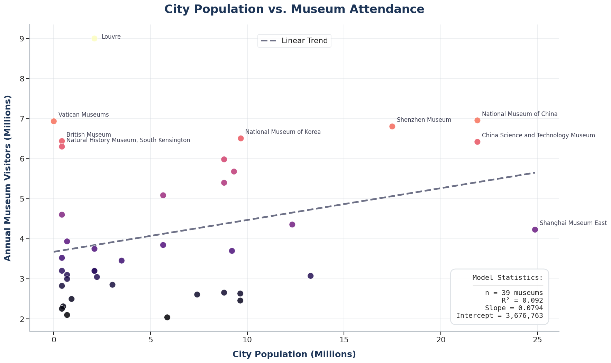
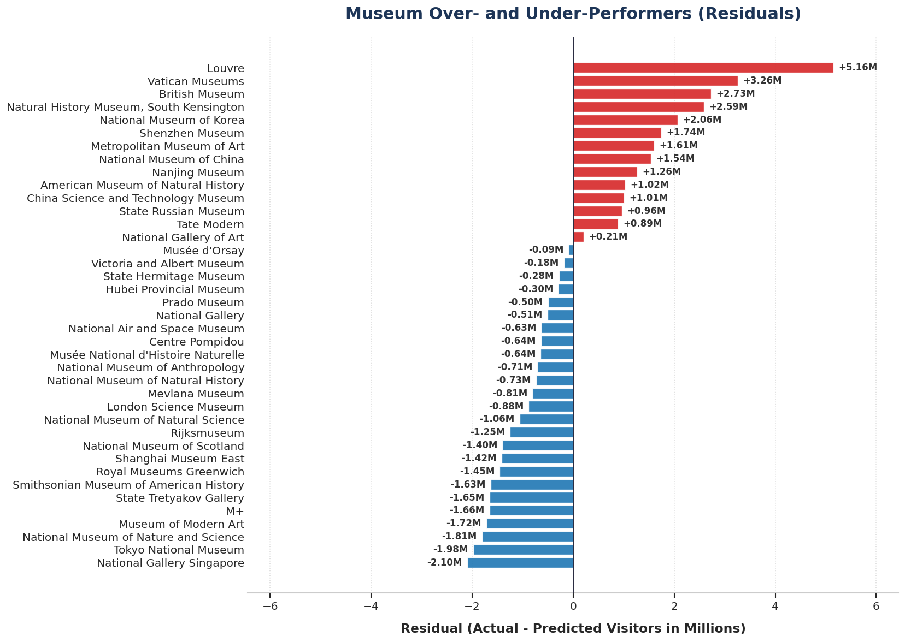
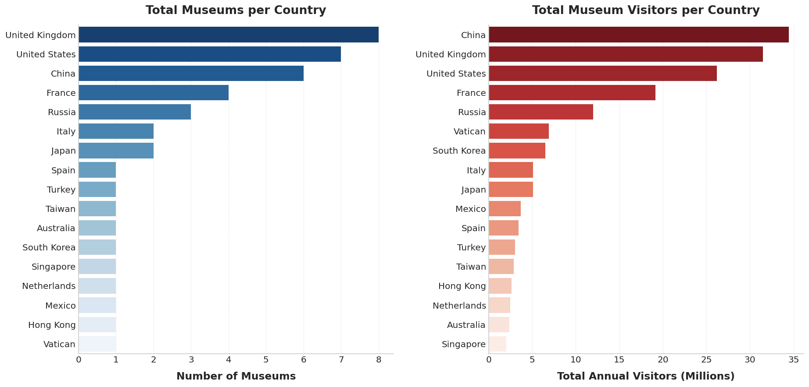

# Museum Visitor Analysis Project

Hi there! Welcome to my assignment submission. This project builds a complete end-to-end data pipeline that extracts the world's most-visited museums, correlates their attendance with local city population data, and runs a linear regression model to find patterns.

The entire project is containerized, fully tested, and reproducible.

## Table of Contents
1. [How to Run It](#how-to-run-it)
2. [Where Everything Is (Project Structure)](#where-everything-is)
3. [The ETL Pipeline & Handling Missing Data](#the-etl-pipeline--handling-missing-data)
4. [Why I Stuck to the Assignment Data](#why-i-stuck-to-the-assignment-data)
5. [Final Results & Conclusions](#final-results--conclusions)

---

## How to Run It

You don't need to install Python, PostgreSQL, or Jupyter locally. As long as you have Docker Desktop running, the entire stack will build itself.

```bash
# Start the database, run the ETL pipeline, and launch Jupyter
docker compose up
```

Once the terminal says the notebook server is running, open **http://localhost:8888** in your browser and click on `analysis.ipynb`. You can safely click "Run All Cells"—the notebook is smart enough to know the database is already populated and won't double-run the pipeline.

---

## Where Everything Is

I structured this repository like a production-grade Python package rather than a loose collection of scripts. Here is where you can find the core logic:

- **`museums/ingestion/wikipedia.py`**: This is where I scrape the "List of most-visited museums". Instead of brittle HTML parsing, I hit the MediaWiki Action API to extract the raw wikitext and parse the table safely.
- **`museums/ingestion/population.py`**: This file handles querying the Wikidata Search API to find the correct "City" entity (QID), followed by a batched SPARQL query to retrieve populations efficiently.
- **`config/city_overrides.yaml`**: A YAML configuration file used to manually resolve tricky city names (like Vatican City or Singapore) that the dynamic Wikidata search struggles with.
- **`museums/pipeline/etl.py`**: The orchestrator. It ties the ingestion and database saving together.
- **`museums/ml/regression.py`**: The linear regression logic built using `scikit-learn`.
- **`tests/`**: A full suite of `pytest` unit tests (with descriptive edge-case catches) that run entirely offline by mocking the Wikipedia APIs.

---

## The ETL Pipeline & Handling Missing Data

When fetching populations from Wikidata, we inevitably hit edge cases. For instance, searching for "Singapore" or "Vatican City" dynamically can fail or return the wrong entity because they are independent city-states rather than traditional administrative cities.

Initially, these failed lookups resulted in `NaN` (missing) populations. **Rather than dropping those rows**, I built a production-style fallback mechanism:
I introduced a static `config/city_overrides.yaml` file. The pipeline checks this file first; if a city is listed there, it bypasses the API search and uses the hardcoded Wikidata QID. This ensures **100% data integrity** across the final dataset without cluttering the Python code with hardcoded dictionaries.

---

## Why I Stuck to the Assignment Data

The assignment explicitly asked to "correlate the tourist attendance at their museums with the population of the respective cities."

While looking at the initial low correlation, I was tempted to pull in external datasets (such as international airport arrivals, hotel density, or general tourism metrics) to build a better predictive model. However, in an engineering context, **scope discipline is critical**. I purposefully constrained the pipeline to *only* use the data requested by the prompt (City Population vs. Museum Visitors).

Rather than masking the weak correlation with unrequested data, I chose to present the findings honestly and treat the limitations of the dataset as an analytical conclusion (see below).

---

## Final Results & Conclusions

If you open the `analysis.ipynb` notebook, you will see a detailed breakdown of the linear regression. The most important takeaway is that **the $R^2$ score is extremely low (around 0.09)**.



This highlights an interesting insight from the dataset:

1. **Local Population is a Poor Predictor:** The model attempts to predict museum attendance based on local residents. However, places like the Louvre (Paris) or the Vatican Museums (Vatican City) are overwhelmingly driven by **global tourism**, not locals. Vatican City has fewer than 1,000 residents but 7 million annual visitors!
2. **Administrative Boundaries Skew Data:** We pull the "City Proper" population from Wikidata. Paris shows a population of ~2.1 million (the strict city limits) rather than its metropolitan population of ~12 million. Comparing city-proper to city-proper is often an "apples to oranges" comparison globally.

At the end of the day, while the pipeline successfully merged the two APIs into a harmonized database, predicting museum attendance clearly requires features well beyond just local population size (e.g. international airport arrivals, hotel capacity, etc.).

### Top Performers and Residuals

By calculating the model's residuals, we can clearly see which museums drastically over-perform their local population (like the Louvre and Vatican Museums), and which under-perform expectations based purely on population size.



### Global Distribution


